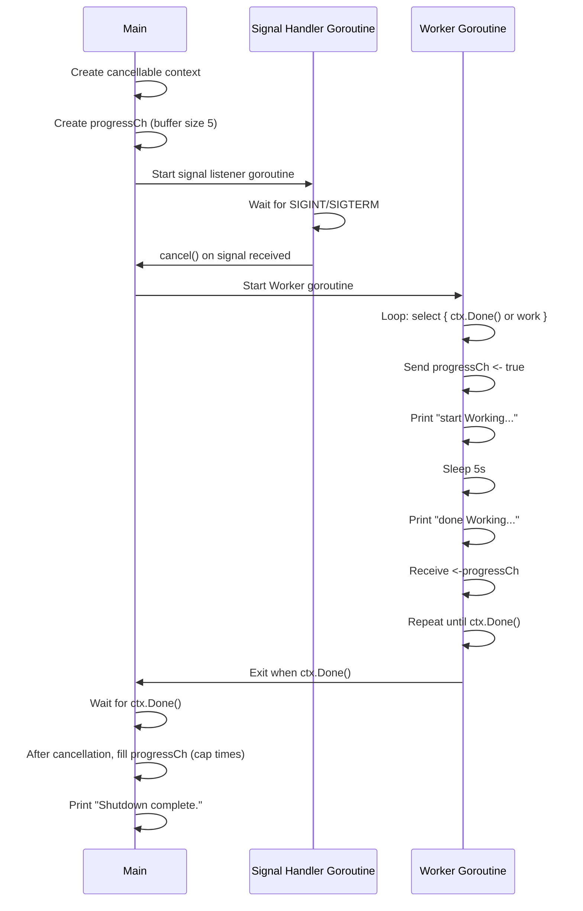

## ⚠️ Important Note:
This pattern works for one worker, but if you add multiple workers or dynamic tasks, it can deadlock or panic because:
• Hardcoded buffer size (cap(progressCh)) assumes max concurrency.
• Closing the channel while other goroutines send can cause send on closed channel.

for best
