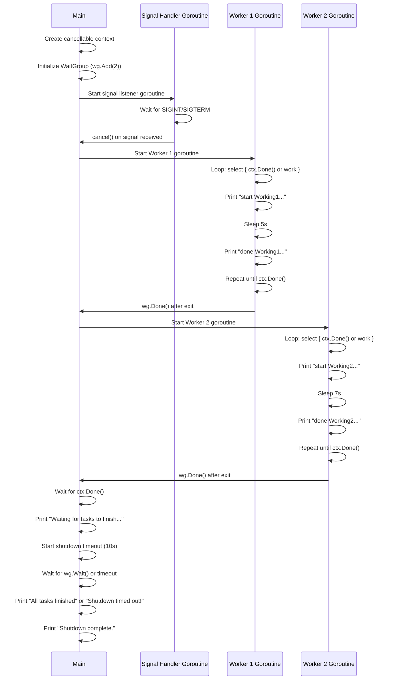

```mermaid
sequenceDiagram
    participant Main
    participant SignalHandler as Signal Handler Goroutine
    participant Worker1 as Worker 1 Goroutine
    participant Worker2 as Worker 2 Goroutine

    Main->>Main: Create cancellable context
    Main->>Main: Initialize WaitGroup (wg.Add(2))
    Main->>SignalHandler: Start signal listener goroutine
    SignalHandler->>SignalHandler: Wait for SIGINT/SIGTERM
    SignalHandler->>Main: cancel() on signal received

    Main->>Worker1: Start Worker 1 goroutine
    Worker1->>Worker1: Loop: select { ctx.Done() or work }
    Worker1->>Worker1: Print "start Working1..."
    Worker1->>Worker1: Sleep 5s
    Worker1->>Worker1: Print "done Working1..."
    Worker1->>Worker1: Repeat until ctx.Done()
    Worker1->>Main: wg.Done() after exit

    Main->>Worker2: Start Worker 2 goroutine
    Worker2->>Worker2: Loop: select { ctx.Done() or work }
    Worker2->>Worker2: Print "start Working2..."
    Worker2->>Worker2: Sleep 7s
    Worker2->>Worker2: Print "done Working2..."
    Worker2->>Worker2: Repeat until ctx.Done()
    Worker2->>Main: wg.Done() after exit

    Main->>Main: Wait for ctx.Done()
    Main->>Main: Print "Waiting for tasks to finish..."
    Main->>Main: Start shutdown timeout (10s)
    Main->>Main: Wait for wg.Wait() or timeout
    Main->>Main: Print "All tasks finished" or "Shutdown timed out!"
    Main->>Main: Print "Shutdown complete."

```