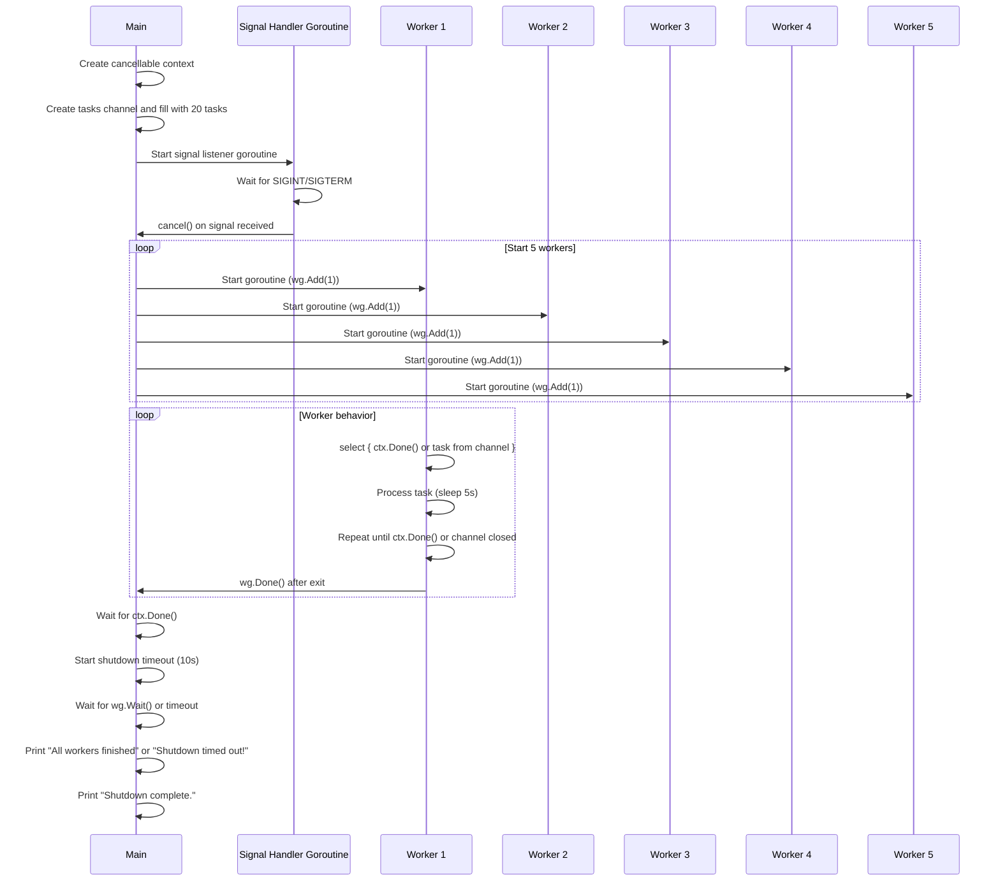

- Context cancellation: Cleanly propagates shutdown signals.
- Signal handling: Captures SIGINT and SIGTERM. 
- Worker pool: Uses a channel to distribute tasks to multiple workers. 
- WaitGroup: Ensures all workers finish before shutdown. 
- Timeout: Prevents hanging forever if workers misbehave.