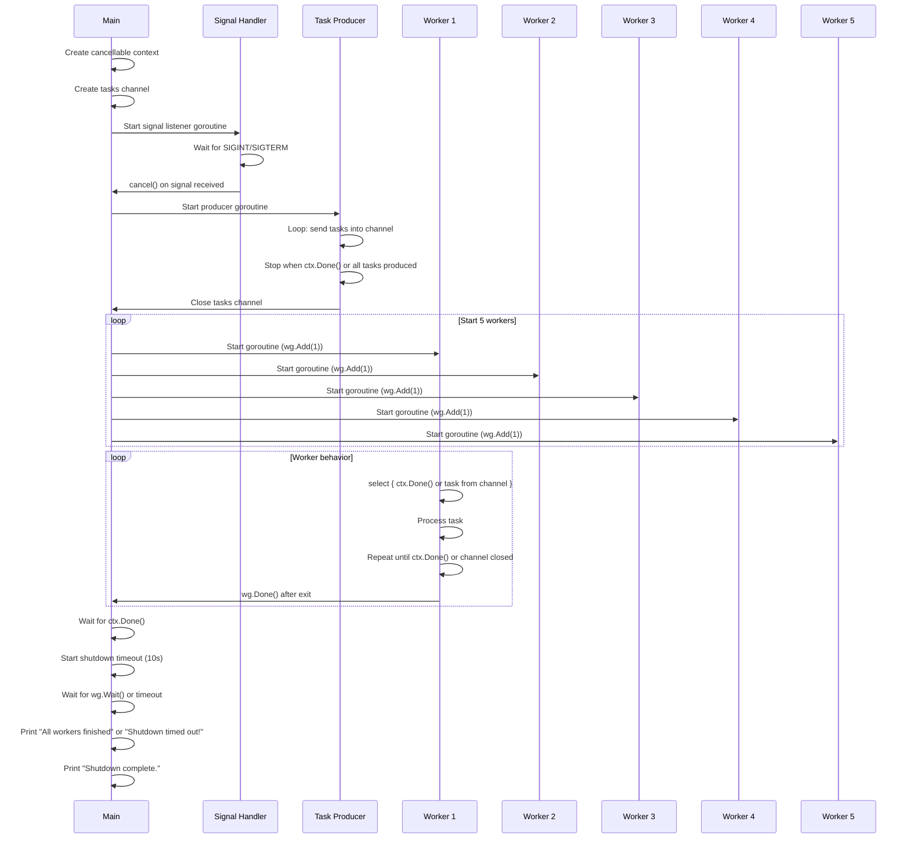

```mermaid
sequenceDiagram
    participant Main
    participant SignalHandler as Signal Handler
    participant Producer as Task Producer
    participant Worker1 as Worker 1
    participant Worker2 as Worker 2
    participant Worker3 as Worker 3
    participant Worker4 as Worker 4
    participant Worker5 as Worker 5

    Main->>Main: Create cancellable context
    Main->>Main: Create tasks channel
    Main->>SignalHandler: Start signal listener goroutine
    SignalHandler->>SignalHandler: Wait for SIGINT/SIGTERM
    SignalHandler->>Main: cancel() on signal received

    Main->>Producer: Start producer goroutine
    Producer->>Producer: Loop: send tasks into channel
    Producer->>Producer: Stop when ctx.Done() or all tasks produced
    Producer->>Main: Close tasks channel

    loop Start 5 workers
        Main->>Worker1: Start goroutine (wg.Add(1))
        Main->>Worker2: Start goroutine (wg.Add(1))
        Main->>Worker3: Start goroutine (wg.Add(1))
        Main->>Worker4: Start goroutine (wg.Add(1))
        Main->>Worker5: Start goroutine (wg.Add(1))
    end

    loop Worker behavior
        Worker1->>Worker1: select { ctx.Done() or task from channel }
        Worker1->>Worker1: Process task
        Worker1->>Worker1: Repeat until ctx.Done() or channel closed
        Worker1->>Main: wg.Done() after exit
    end

    Main->>Main: Wait for ctx.Done()
    Main->>Main: Start shutdown timeout (10s)
    Main->>Main: Wait for wg.Wait() or timeout
    Main->>Main: Print "All workers finished" or "Shutdown timed out!"
    Main->>Main: Print "Shutdown complete."

```