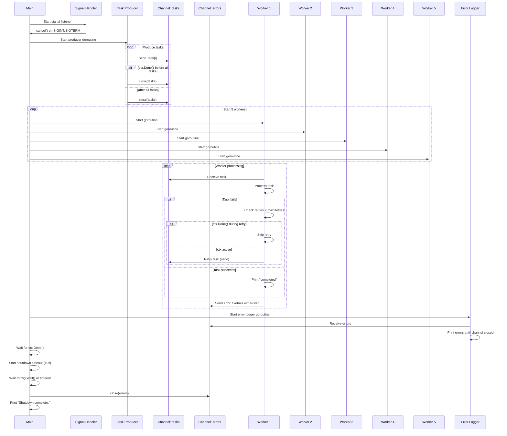

```mermaid
sequenceDiagram
    participant Main
    participant SignalHandler as Signal Handler
    participant Producer as Task Producer
    participant TasksChannel as Channel: tasks
    participant ErrorsChannel as Channel: errors
    participant Worker1 as Worker 1
    participant Worker2 as Worker 2
    participant Worker3 as Worker 3
    participant Worker4 as Worker 4
    participant Worker5 as Worker 5
    participant ErrorLogger as Error Logger

    Main->>SignalHandler: Start signal listener
    SignalHandler->>Main: cancel() on SIGINT/SIGTERM

    Main->>Producer: Start producer goroutine
    loop Produce tasks
        Producer->>TasksChannel: Send Task{i}
    end
    alt ctx.Done() before all tasks
        Producer->>TasksChannel: close(tasks)
    else after all tasks
        Producer->>TasksChannel: close(tasks)
    end

    loop Start 5 workers
        Main->>Worker1: Start goroutine
        Main->>Worker2: Start goroutine
        Main->>Worker3: Start goroutine
        Main->>Worker4: Start goroutine
        Main->>Worker5: Start goroutine
    end

    loop Worker processing
        Worker1->>TasksChannel: Receive task
        Worker1->>Worker1: Process task
        alt Task fails
            Worker1->>Worker1: Check retries < maxRetries
            alt ctx.Done() during retry
                Worker1->>Worker1: Skip retry
            else ctx active
                Worker1->>TasksChannel: Retry task (send)
            end
        else Task succeeds
            Worker1->>Worker1: Print "completed"
        end
        Worker1->>ErrorsChannel: Send error if retries exhausted
    end

    Main->>ErrorLogger: Start error logger goroutine
    ErrorLogger->>ErrorsChannel: Receive errors
    ErrorLogger->>ErrorLogger: Print errors until channel closed

    Main->>Main: Wait for ctx.Done()
    Main->>Main: Start shutdown timeout (10s)
    Main->>Main: Wait for wg.Wait() or timeout
    Main->>ErrorsChannel: close(errors)
    Main->>Main: Print "Shutdown complete."
```
