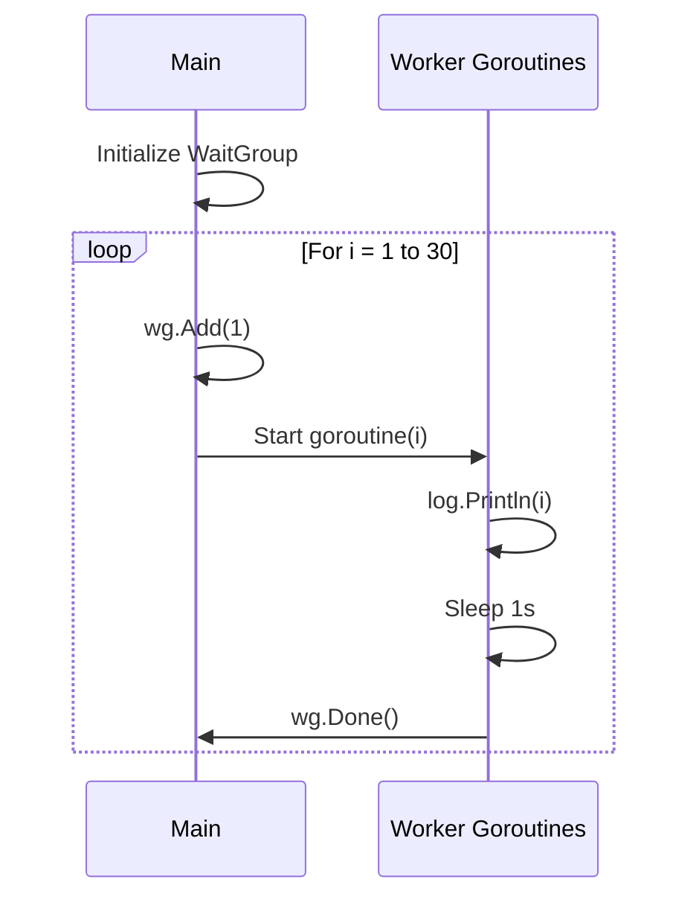

```mermaid
sequenceDiagram
    participant Main
    participant Goroutines as Worker Goroutines

    Main->>Main: Initialize WaitGroup
    loop For i = 1 to 30
        Main->>Main: wg.Add(1)
        Main->>Goroutines: Start goroutine(i)
        Goroutines->>Goroutines: log.Println(i)
        Goroutines->>Goroutines: Sleep 1s
        Goroutines->>Main: wg.Done()
    end
```