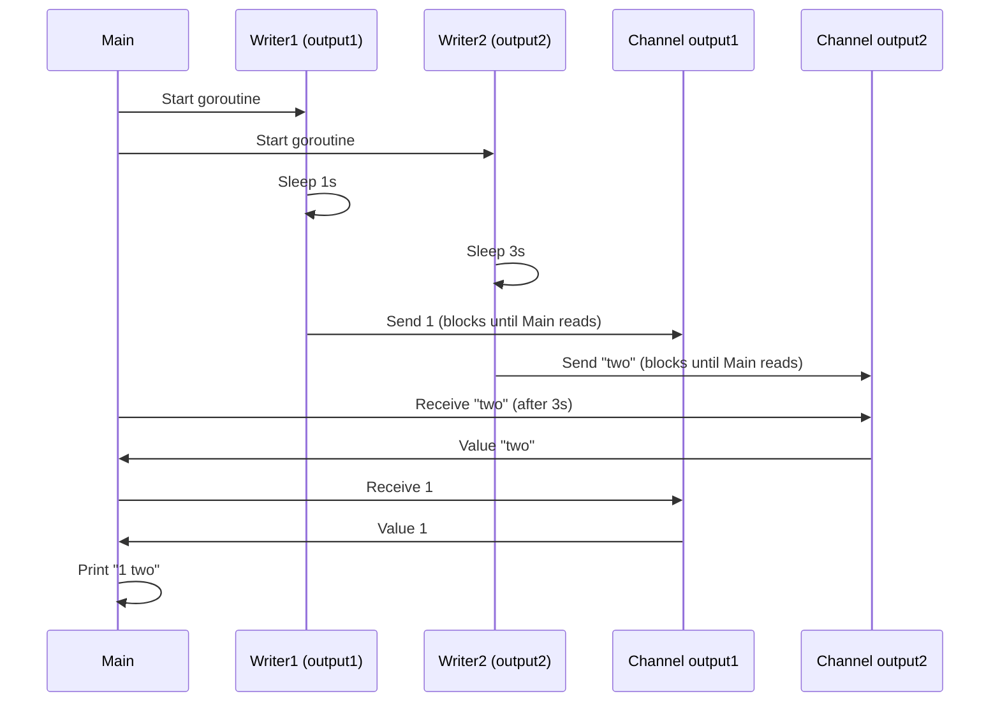

```mermaid
sequenceDiagram
    participant Main
    participant Gor1 as Writer1 (output1)
    participant Gor2 as Writer2 (output2)
    participant Ch1 as Channel output1
    participant Ch2 as Channel output2

    Main->>Gor1: Start goroutine
    Main->>Gor2: Start goroutine

    Gor1->>Gor1: Sleep 1s
    Gor2->>Gor2: Sleep 3s

    Gor1->>Ch1: Send 1 (blocks until Main reads)
    Gor2->>Ch2: Send "two" (blocks until Main reads)

    Main->>Ch2: Receive "two" (after 3s)
    Ch2->>Main: Value "two"
    Main->>Ch1: Receive 1
    Ch1->>Main: Value 1

    Main->>Main: Print "1 two"
```