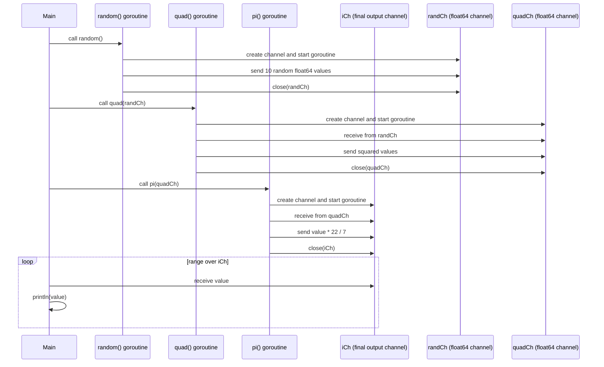

```mermaid
sequenceDiagram
    participant Main
    participant randomFn as random() goroutine
    participant quadFn as quad() goroutine
    participant piFn as pi() goroutine
    participant iCh as iCh (final output channel)
    participant randCh as randCh (float64 channel)
    participant quadCh as quadCh (float64 channel)

    Main->>randomFn: call random()
    randomFn->>randCh: create channel and start goroutine
    randomFn->>randCh: send 10 random float64 values
    randomFn->>randCh: close(randCh)

    Main->>quadFn: call quad(randCh)
    quadFn->>quadCh: create channel and start goroutine
    quadFn->>quadCh: receive from randCh
    quadFn->>quadCh: send squared values
    quadFn->>quadCh: close(quadCh)

    Main->>piFn: call pi(quadCh)
    piFn->>iCh: create channel and start goroutine
    piFn->>iCh: receive from quadCh
    piFn->>iCh: send value * 22 / 7
    piFn->>iCh: close(iCh)

    loop range over iCh
        Main->>iCh: receive value
        Main->>Main: println(value)
    end
```