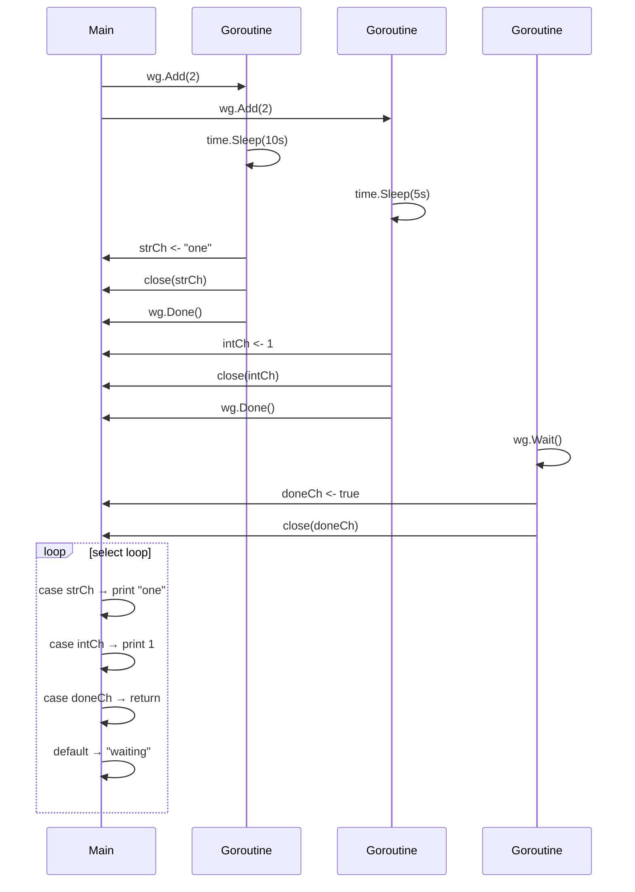

```mermaid

sequenceDiagram
    participant Main
    participant Goroutine1 as Goroutine #1 (strCh)
    participant Goroutine2 as Goroutine #2 (intCh)
    participant Goroutine3 as Goroutine #3 (doneCh)

    Main->>Goroutine1: wg.Add(2)
    Main->>Goroutine2: wg.Add(2)

    Goroutine1->>Goroutine1: time.Sleep(10s)
    Goroutine2->>Goroutine2: time.Sleep(5s)

    Goroutine1->>Main: strCh <- "one"
    Goroutine1->>Main: close(strCh)
    Goroutine1->>Main: wg.Done()

    Goroutine2->>Main: intCh <- 1
    Goroutine2->>Main: close(intCh)
    Goroutine2->>Main: wg.Done()

    Goroutine3->>Goroutine3: wg.Wait()
    Goroutine3->>Main: doneCh <- true
    Goroutine3->>Main: close(doneCh)

    loop select loop
        Main->>Main: case strCh → print "one"
        Main->>Main: case intCh → print 1
        Main->>Main: case doneCh → return
        Main->>Main: default → "waiting"
    end

```