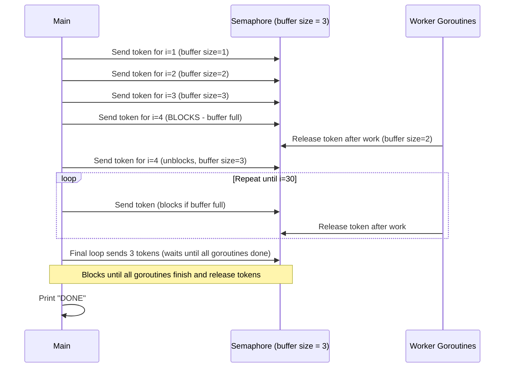

```mermaid
sequenceDiagram
    participant Main
    participant Sem as Semaphore (buffer size = 3)
    participant Gor as Worker Goroutines

    Main->>Sem: Send token for i=1 (buffer size=1)
    Main->>Sem: Send token for i=2 (buffer size=2)
    Main->>Sem: Send token for i=3 (buffer size=3)
    Main->>Sem: Send token for i=4 (BLOCKS - buffer full)

    Gor->>Sem: Release token after work (buffer size=2)
    Main->>Sem: Send token for i=4 (unblocks, buffer size=3)
    loop Repeat until i=30
        Main->>Sem: Send token (blocks if buffer full)
        Gor->>Sem: Release token after work
    end

    Main->>Sem: Final loop sends 3 tokens (waits until all goroutines done)
    Note over Main,Sem: Blocks until all goroutines finish and release tokens
    Main->>Main: Print "DONE"
```