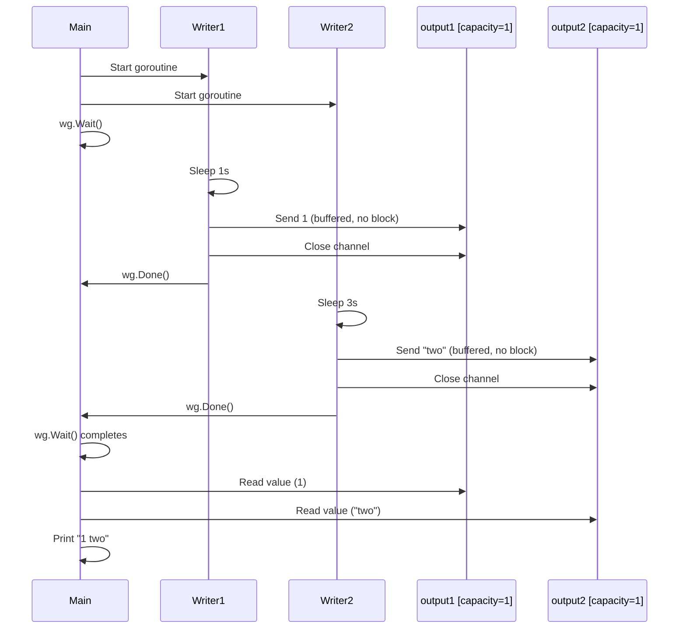

```mermaid
sequenceDiagram
    participant Main
    participant Writer1
    participant Writer2
    participant Buffer1 as output1 [capacity=1]
    participant Buffer2 as output2 [capacity=1]

    Main->>Writer1: Start goroutine
    Main->>Writer2: Start goroutine
    Main->>Main: wg.Wait()

    Writer1->>Writer1: Sleep 1s
    Writer1->>Buffer1: Send 1 (buffered, no block)
    Writer1->>Buffer1: Close channel
    Writer1->>Main: wg.Done()

    Writer2->>Writer2: Sleep 3s
    Writer2->>Buffer2: Send "two" (buffered, no block)
    Writer2->>Buffer2: Close channel
    Writer2->>Main: wg.Done()

    Main->>Main: wg.Wait() completes
    Main->>Buffer1: Read value (1)
    Main->>Buffer2: Read value ("two")
    Main->>Main: Print "1 two"

```