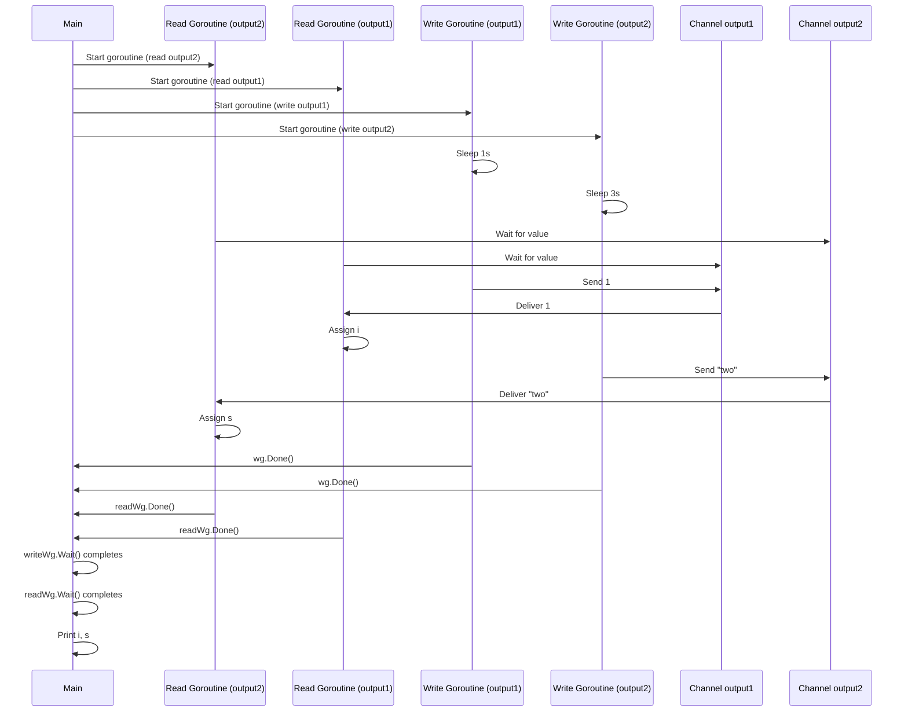

```mermaid
sequenceDiagram
    participant Main
    participant Reader1 as Read Goroutine (output2)
    participant Reader2 as Read Goroutine (output1)
    participant Writer1 as Write Goroutine (output1)
    participant Writer2 as Write Goroutine (output2)
    participant Ch1 as Channel output1
    participant Ch2 as Channel output2

    Main->>Reader1: Start goroutine (read output2)
    Main->>Reader2: Start goroutine (read output1)
    Main->>Writer1: Start goroutine (write output1)
    Main->>Writer2: Start goroutine (write output2)

    Writer1->>Writer1: Sleep 1s
    Writer2->>Writer2: Sleep 3s

    Reader1->>Ch2: Wait for value
    Reader2->>Ch1: Wait for value

    Writer1->>Ch1: Send 1
    Ch1->>Reader2: Deliver 1
    Reader2->>Reader2: Assign i

    Writer2->>Ch2: Send "two"
    Ch2->>Reader1: Deliver "two"
    Reader1->>Reader1: Assign s

    Writer1->>Main: wg.Done()
    Writer2->>Main: wg.Done()
    Reader1->>Main: readWg.Done()
    Reader2->>Main: readWg.Done()

    Main->>Main: writeWg.Wait() completes
    Main->>Main: readWg.Wait() completes
    Main->>Main: Print i, s
```